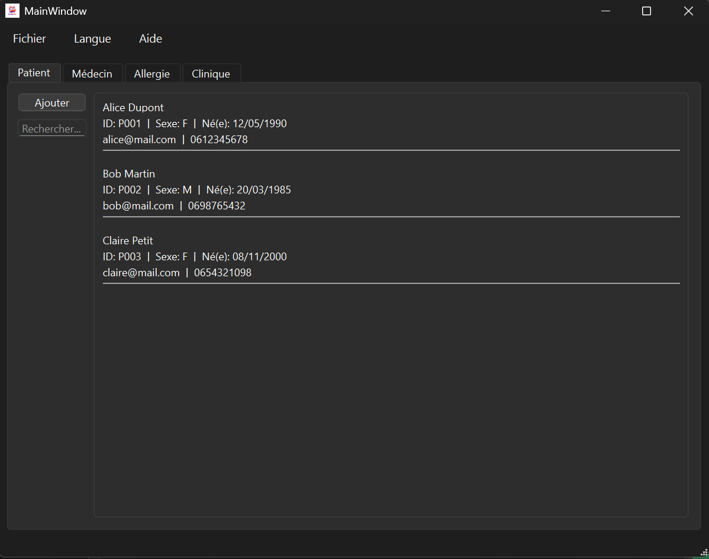

# HealthFile - Application de Gestion de Santé

Application Qt/C++ de gestion de dossiers médicaux avec suivi nutrition et santé.

## 🎯 Fonctionnalités

- Gestion de dossiers médicaux personnels
- Suivi nutritionnel et calcul des calories
- Interface graphique moderne avec Qt
- Base de données locale pour le stockage des informations
- Gestion de recettes et d'aliments
- Traduction multilingue (FR/EN)

## 🛠️ Technologies

- **Langage**: C++
- **Framework**: Qt 6.10
- **Build System**: CMake
- **Base de données**: SQLite (via Qt SQL)

## 📋 Prérequis

- Qt 6.10 ou supérieur
- CMake 3.16 ou supérieur
- Compilateur C++ compatible (MinGW, GCC, ou MSVC)

## 🚀 Installation

```bash
# Cloner le dépôt
git clone https://github.com/bikelalif/healthfile.git
cd healthfile

# Créer le dossier de build
mkdir build
cd build

# Configurer avec CMake
cmake ..

# Compiler
cmake --build .
```

## 📦 Structure du Projet

```
healthfile/
├── CMakeLists.txt          # Configuration CMake
├── src/                    # Code source principal
├── header/                 # Fichiers d'en-tête
├── resources/             # Ressources (icônes, images)
│   └── icons/             # Icônes de l'application
├── translations/          # Fichiers de traduction
├── cooking/               # Module de gestion des recettes
├── build/                 # Dossier de compilation
└── rapport/               # Documentation du projet
```

## 🎨 Captures d'écran



## 📖 Utilisation

L'application permet de :
1. Créer et gérer des dossiers médicaux
2. Suivre son alimentation avec calcul des calories
3. Gérer une base de données de recettes
4. Consulter l'historique de santé

## 👨‍💻 Développement

Ce projet a été développé dans le cadre d'un cours de programmation orientée objet en C++, avec un focus sur :
- Architecture logicielle avec Qt
- Gestion de base de données avec Qt SQL
- Interface graphique avec Qt Widgets
- Internationalisation (i18n)

## 📄 Licence

Projet académique - ENSIIE

## 📧 Contact

Bilal KEFIF - [GitHub](https://github.com/bikelalif)
